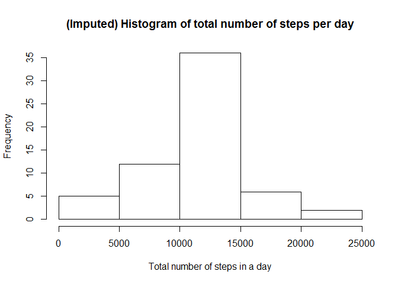
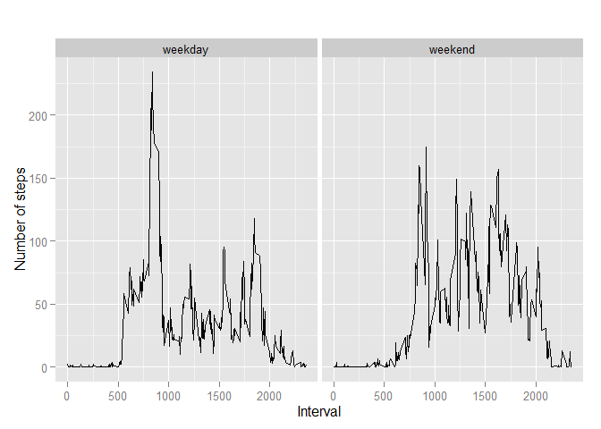

# Reproducible Research: Peer Assessment 1


## Loading and preprocessing the data
Show any code that is needed to

1. Load the data
2. Process/transform the data (if necessary) into a format suitable for your analysis

```r
data <- read.csv("activity.csv")
data_steps_date <- aggregate(steps ~ date, data, sum, na.rm=TRUE)
```


## What is mean total number of steps taken per day?
For this part of the assignment, you can ignore the missing values in the dataset.

1. Make a histogram of the total number of steps taken each day

```r
hist(data_steps_date$steps, main="Histogram of total number of steps per day", xlab="Total number of steps in a day")
```

 

2. Calculate and report the mean and median total number of steps taken per day

```r
mean(data_steps_date$steps)
```

```
## [1] 10766.19
```

```r
median(data_steps_date$steps)
```

```
## [1] 10765
```
*The mean and median total number of steps per day are 10766 and 10765 steps respectively.*


## What is the average daily activity pattern?
1. Make a time series plot (i.e. type = "l") of the 5-minute interval (x-axis) and the average number of steps taken, averaged across all days (y-axis)

```r
# aggregate steps as interval to get average number of steps in an interval across all days
data_steps_interval <- aggregate(steps ~ interval, data, mean)

# generate the line plot of the 5-minute interval (x-axis) and the average number of 
# steps taken, averaged across all days (y-axis)
plot(data_steps_interval$interval, data_steps_interval$steps, type='l',  
     main="Average number of steps averaged over all days", xlab="Interval", 
     ylab="Average number of steps")
```

 

2. Which 5-minute interval, on average across all the days in the dataset, contains the maximum number of steps?

```r
max_steps_id <- which.max(data_steps_interval$steps)
data_steps_interval[max_steps_id, ]
```

```
##     interval    steps
## 104      835 206.1698
```
*The interval of 835 contains the maximum number of steps (206).*


## Imputing missing values
Note that there are a number of days/intervals where there are missing values (coded as NA). The presence of missing days may introduce bias into some calculations or summaries of the data.

1. Calculate and report the total number of missing values in the dataset (i.e. the total number of rows with NAs)

```r
missing_vals <- data[!complete.cases(data),]
nrow(missing_vals)
```

```
## [1] 2304
```
*There is a total of 2304 missing values in the dataset.*

2. Devise a strategy for filling in all of the missing values in the dataset. The strategy does not need to be sophisticated. For example, you could use the mean/median for that day, or the mean for that 5-minute interval, etc.

*We have already calculated the mean for each 5-minute interval earlier in our "data_steps_interval" dataset.*

*We can replace each NA by its corresponding mean value from the above dataset.*

3. Create a new dataset that is equal to the original dataset but with the missing data filled in.

```r
data2 <- data
for (i in 1:nrow(data2)) {
  if (is.na(data$steps[i])) {
    interval_val <- data2$interval[i]
    row_id <- which(data_steps_interval$interval == interval_val)
    mean_val <- data_steps_interval$steps[row_id]
    data2$steps[i] <- mean_val
  }
}
```

4. Make a histogram of the total number of steps taken each day and Calculate and report the mean and median total number of steps taken per day. Do these values differ from the estimates from the first part of the assignment? What is the impact of imputing missing data on the estimates of the total daily number of steps?


```r
# aggregate steps as per date to get total number of steps in a day
data2_steps_date_imputed <- aggregate(steps ~ date, data2, sum)

# create histogram of total number of steps in a day
hist(data2_steps_date_imputed$steps, main="(Imputed) Histogram of total number of steps per day", xlab="Total number of steps in a day")
```

 

```r
# get mean and median of total number of steps per day
mean(data2_steps_date_imputed$steps)
```

```
## [1] 10766.19
```

```r
median(data2_steps_date_imputed$steps)
```

```
## [1] 10766.19
```
*Due to data imputation, the mean value remains the same. There is slight increase in the median value.*


## Are there differences in activity patterns between weekdays and weekends?

For this part the weekdays() function may be of some help here. Use the dataset with the filled-in missing values for this part.

1. Create a new factor variable in the dataset with two levels -- "weekday" and "weekend" indicating whether a given date is a weekday or weekend day.

```r
# convert date from string to Date class
data$date <- as.Date(data$date, "%Y-%m-%d")

# add a new column indicating day of the week 
data$day <- weekdays(data$date)

# add a new column called day type and initialize to weekday
data$day_type <- c("weekday")

# If day is Saturday or Sunday, make day_type as weekend
for (i in 1:nrow(data)){
  if (data$day[i] == "Saturday" || data$day[i] == "Sunday"){
    data$day_type[i] <- "weekend"
  }
}

# convert day_time from character to factor
data$day_type <- as.factor(data$day_type)
```

2. Make a panel plot containing a time series plot (i.e. type = "l") of the 5-minute interval (x-axis) and the average number of steps taken, averaged across all weekday days or weekend days (y-axis). 

```r
# aggregate steps as interval to get average number of steps in an interval across all days
data_steps_interval <- aggregate(steps ~ interval+day_type, data, mean)

# make the panel plot for weekdays and weekends
library(ggplot2)
qplot(interval, steps, data=data_steps_interval, geom=c("line"), xlab="Interval", 
      ylab="Number of steps", main="") + facet_wrap(~ day_type)
```

 
